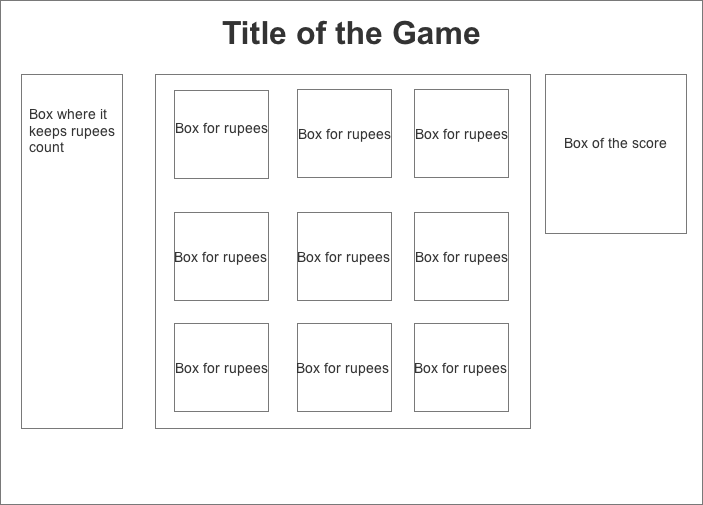

# Zelda Matching Ruppie

Zelda Matching Ruppie  is a game where you will have to find the matching ruppie around the board and put each one of the ruppies with their matching one. 

Enjoy the game!

##Wireframe

## MVP

* Randomize the ruppies around the board.
* when randomize make matching ruppies sow there isnt 1 left out.
* Make the ruppies clickable and add a switch function where it will let the player switch the ruppies around the board.
* Lock the ruppies that are paired to each other.

##Technologies to be used
* HTML
* CSS
* JQuery
* Javascript

##Links

* [Trello](https://trello.com/b/h4pOEyz1/project-1)

